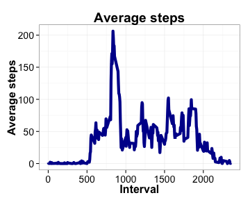
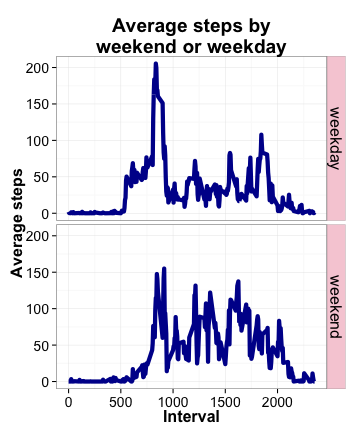

## Loading and preprocessing the data


```r
setwd("/Users/rebeccalowdon/Dropbox/coursera/ReproducibleResearch/assignment1/RepData_PeerAssessment1/")
library("dplyr")
library("ggplot2")
```

Load the CSV. Use the `dplyr` package to make the `data.frame` a `tbl_df` data structure.


```r
activity  <- read.csv("activity.csv", header=TRUE)
activity  <- tbl_df(activity)
```


## What is mean total number of steps taken per day?

Make a histogram of the **total number of steps taken each day**.  
Using `dplyr` functions, find the daily mean of `steps`.
Plot a histogram of total number of steps taken each day.


```r
h  <- group_by(activity, date) %>%
    summarise(total_steps = sum(steps))
breaks = max(h$total_steps, na.rm=TRUE) / 1000
hist(h$total_steps, main="Total number of steps per day\nRaw values",
     breaks = breaks,
     xlim=c(0,25000),
     xlab="Total steps")
```

 

Caclulate the **mean** and **median** total number of steps taken each day.  


```r
mean(h$total_steps, na.rm=TRUE)
```

```
## [1] 10766.19
```

```r
median(h$total_steps, na.rm=TRUE)
```

```
## [1] 10765
```


## What is the average daily activity pattern?

Time series plot. Use `dplyr` to average each 5 min interval across all days.


```r
by_5min <- group_by(activity, interval)
p  <- summarise(by_5min, avg_steps=mean(steps, na.rm = TRUE))

plt <- ggplot(p, aes(interval, avg_steps)) + 
    geom_line(colour="#000099",size=2) + theme_bw()

lbl.txt <- element_text(face="bold",size=16)
axis.txt <- element_text(size=14)

plt <- plt + labs(title="Average steps",x="Interval",y="Average steps") + 
    theme(title=element_text(size=16,face="bold"),
          axis.title=lbl.txt,axis.text=axis.txt) 

plt
```

 

Which 5-minute interval, on average across all the days in the dataset, contains the maximum number of steps?  


```r
p[p$avg_steps==max(p$avg_steps),1]
```

```
## Source: local data frame [1 x 1]
## 
##   interval
## 1      835
```

The 5-minute interval with the max number of steps across all days is **835**.

## Imputing missing values

Find the total number of missing values (of steps).  


```r
with(activity, table(is.na(steps)))
```

```
## 
## FALSE  TRUE 
## 15264  2304
```

The total number of missing values in the `steps` colums is **2304**.  

Compute the missing values based on the median number of steps for that interval over all 30 days. Use `dplyr` to calculate the median value for each interval -- these values are the `med_steps` column in the `all_steps` data.frame.  
Then replace each instance of `NA` in `steps` column with the median value for that interval using the for loop. Finally remove the `med_steps` column. Imputed values saved in `imp_activity`.


```r
all_steps  <- group_by(activity, interval) %>%
    mutate(med_steps = median(steps, na.rm = TRUE))

for(i in 1:length(all_steps$med_steps)){
    if(is.na(all_steps$steps[i])==TRUE){
        all_steps$steps[i] = all_steps$med_steps[i]
    }
}

imp_activty <- select(all_steps, 1:3)
head(imp_activty)
```

```
## Source: local data frame [6 x 3]
## Groups: interval
## 
##   steps       date interval
## 1     0 2012-10-01        0
## 2     0 2012-10-01        5
## 3     0 2012-10-01       10
## 4     0 2012-10-01       15
## 5     0 2012-10-01       20
## 6     0 2012-10-01       25
```

Make a histogram of the total number of steps taken each day and calculate and report the mean and median total number of steps taken per day. 


```r
h2  <- group_by(imp_activty, date) %>%
    summarise(total_steps = sum(steps))
breaks = max(h$total_steps, na.rm=TRUE) / 1000
hist(h2$total_steps, main="Total number of steps per day\nImputed values",
     breaks = breaks,
     xlim=c(0,25000),
     xlab="Total steps")
```

 

```r
mean(h2$total_steps)
```

```
## [1] 9503.869
```

```r
median(h2$total_steps)
```

```
## [1] 10395
```

The mean number of steps is **9503.869** and the median is **10395**.

_Do these values differ from the estimates from the first part of the assignment? What is the impact of imputing missing data on the estimates of the total daily number of steps?_

The imputed values do differ from raw values: the imputed values lower both the mean and the median. In the histogram, we detect a shift of counts to the lower values.

## Are there differences in activity patterns between weekdays and weekends?

Create a new factor variable in the dataset with two levels – “weekday” and “weekend” indicating whether a given date is a weekday or weekend day.  


```r
new_activity <- ungroup(imp_activty) %>%
    mutate(weekday=weekdays(as.Date(imp_activty$date))) 

for(i in 1:length(new_activity$weekday)){
    if(new_activity$weekday[i]=="Saturday"| new_activity$weekday[i]=="Sunday"){
        new_activity$wkd_type[i]="weekend"
    }
    else{
        new_activity$wkd_type[i]="weekday"
    }
}

clean_activity <- select(new_activity, -4)
head(clean_activity)
```

```
## Source: local data frame [6 x 4]
## 
##   steps       date interval wkd_type
## 1     0 2012-10-01        0  weekday
## 2     0 2012-10-01        5  weekday
## 3     0 2012-10-01       10  weekday
## 4     0 2012-10-01       15  weekday
## 5     0 2012-10-01       20  weekday
## 6     0 2012-10-01       25  weekday
```


Make a panel plot containing a time series plot (i.e. type = "l") of the 5-minute interval (x-axis) and the average number of steps taken, averaged across all weekday days or weekend days (y-axis).   
Use `dplyr` to group data by interval and weekday type. Then use `ggplot2` to make a facet plot. 


```r
p3  <- group_by(clean_activity, interval, wkd_type) %>%
    summarise(avg_steps=mean(steps, na.rm = TRUE))

plt <- ggplot(p3, aes(interval, avg_steps)) + geom_line(colour="#000099",size=2) + 
    facet_grid(wkd_type~.) + theme_bw()

lbl.txt <- element_text(face="bold",size=16)
axis.txt <- element_text(size=14)

plt <- plt + labs(title="Average steps by\nweekend or weekday",x="Interval",y="Average steps") + 
    theme(title=element_text(size=16,face="bold"),
          axis.title=lbl.txt,axis.text=axis.txt) +
    theme(strip.text.y = element_text(size=16), 
          strip.background=element_rect(fill="#F6CED8"))

plt
```

 

Yes there are differences to average steps walked per 5-minute time interval between the weekdays and weekends. Most noticably, on the weekdays there is a spike early in the day (~800 minute mark) that is absent during the weekend. The weekend trend is more intermittant and activity lasts longer throughout the day, not dropping off until after 2000 minutes. On the other hand, the weekdy pattern is marked by the large intial peak at ~800 minutes, followed by a lull in activity and another slight peak at ~1800 minutes. These activity patterns are qualitatively and quantitatively different.
